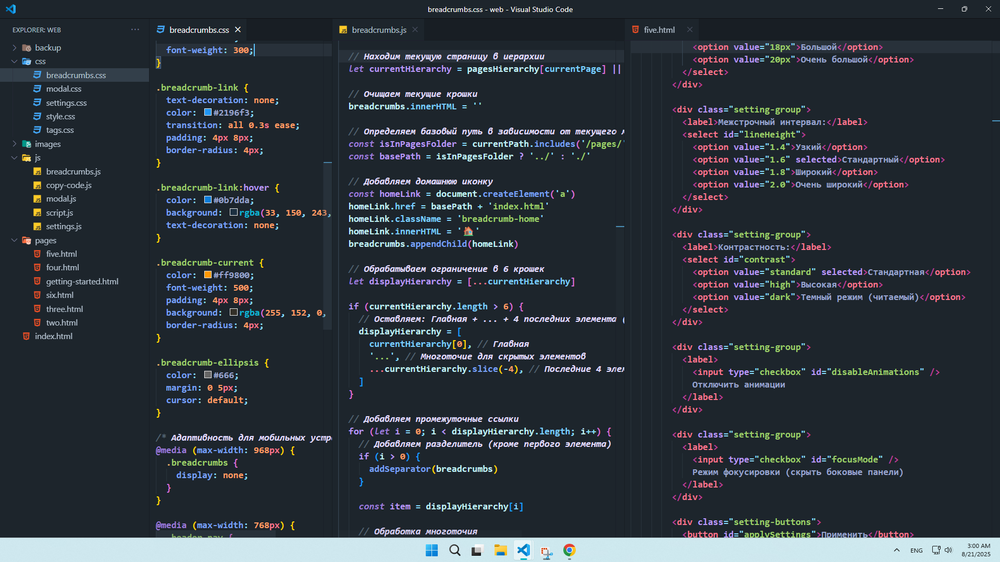

> **ℹ️ Note**  
> I decided to post my settings that I use in VScode on a regular basis.
 

</a>

# Extensions

<a href="https://marketplace.visualstudio.com/items?itemName=formulahendry.auto-rename-tag" target="_blank" rel="noopener noreferrer">Auto Rename Tag</a> 
<a href="https://marketplace.visualstudio.com/items?itemName=pranaygp.vscode-css-peek" target="_blank" rel="noopener noreferrer">CSS Peek</a> 
<a href="https://marketplace.visualstudio.com/items?itemName=huytd.tokyo-city" target="_blank" rel="noopener noreferrer">Tokyo City</a> 
<a href="https://marketplace.visualstudio.com/items/?itemName=zhuangtongfa.Material-theme" target="_blank" rel="noopener noreferrer">One Dark Pro</a> 
<a href="https://marketplace.visualstudio.com/items?itemName=akamud.vscode-theme-onedark" target="_blank" rel="noopener noreferrer">Atom One Dark Theme</a> 
<a href="https://marketplace.visualstudio.com/items?itemName=PKief.material-icon-theme" target="_blank" rel="noopener noreferrer">Material Icon Theme</a> 
<a href="https://marketplace.visualstudio.com/items?itemName=helgardrichard.helium-icon-theme" target="_blank" rel="noopener noreferrer">Helium Icon Theme</a> 
<a href="https://marketplace.visualstudio.com/items?itemName=jeff-hykin.polacode-2019" target="_blank" rel="noopener noreferrer">Polacode-2025</a> 
<a href="https://marketplace.visualstudio.com/items?itemName=esbenp.prettier-vscode" target="_blank" rel="noopener noreferrer">Prettier - Code formatter</a> 
<a href="https://marketplace.visualstudio.com/items?itemName=aliasadidev.nugetpackagemanagergui" target="_blank" rel="noopener noreferrer">NuGet Package Manager GUI</a> 
<a href="https://marketplace.visualstudio.com/items?itemName=ms-dotnettools.csharp" target="_blank" rel="noopener noreferrer">C#</a> 
<a href="https://marketplace.visualstudio.com/items?itemName=ms-dotnettools.csdevkit" target="_blank" rel="noopener noreferrer">C# Dev Kit</a> 
<a href="https://marketplace.visualstudio.com/items?itemName=ms-dotnettools.vscode-dotnet-runtime" target="_blank" rel="noopener noreferrer">.NET Install Tool</a> 
<a href="https://marketplace.visualstudio.com/items?itemName=ritwickdey.LiveServer" target="_blank" rel="noopener noreferrer">Live Server</a> 
<a href="https://marketplace.visualstudio.com/items?itemName=sumneko.lua" target="_blank" rel="noopener noreferrer">Lua</a> 
