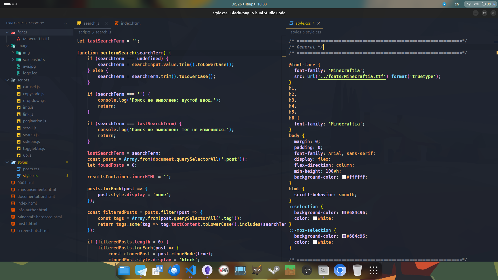

# Vscode-Settings

> I decided to post my settings that I use in VsCode on a regular basis. Sometimes I often change the theme because I don't like it, but at the moment I have settled on one theme, but in the future I may change it. All current updates to my configuration, you can find on GitHub

# Extensions

1. [Auto Rename Tag](https://marketplace.visualstudio.com/items?itemName=formulahendry.auto-rename-tag)
2. [CSS Peek](https://marketplace.visualstudio.com/items?itemName=pranaygp.vscode-css-peek)
3. [Bash Extension Pack](https://marketplace.visualstudio.com/items?itemName=pinage404.bash-extension-pack)
4. [Duck Mode!](https://marketplace.visualstudio.com/items?itemName=MEvesalTR.duck-mode-vscode)
5. [Material Icon Theme](https://marketplace.visualstudio.com/items?itemName=PKief.material-icon-theme)
6. [GlassIt-VSC](https://marketplace.visualstudio.com/items?itemName=s-nlf-fh.glassit)
7. [Polacode-2022](https://marketplace.visualstudio.com/items?itemName=jeff-hykin.polacode-2019)
8. [Live Preview](https://marketplace.visualstudio.com/items?itemName=ms-vscode.live-server)
9. [prettier](https://marketplace.visualstudio.com/items?itemName=esbenp.prettier-vscode)
10. [Nuget GUI Manager](https://marketplace.visualstudio.com/items?itemName=nosa.nugetmanager)
11. [C#](https://marketplace.visualstudio.com/items?itemName=ms-dotnettools.csharp)
12. [C# Dev kit](https://marketplace.visualstudio.com/items?itemName=ms-dotnettools.csdevkit)
13. [.NET install tool](https://marketplace.visualstudio.com/items?itemName=ms-dotnettools.vscode-dotnet-runtime)
14. [CraftOS-PC for VS Code](https://marketplace.visualstudio.com/items?itemName=jackmacwindows.craftos-pc)
15. [lua](https://marketplace.visualstudio.com/items?itemName=sumneko.lua)

I don't use it, but I left it just in case:

1. [Halcyon Theme](https://marketplace.visualstudio.com/items?itemName=brittanychiang.halcyon-vscode)
2. [Catppuccin for VSCode](https://marketplace.visualstudio.com/items?itemName=Catppuccin.catppuccin-vsc)
